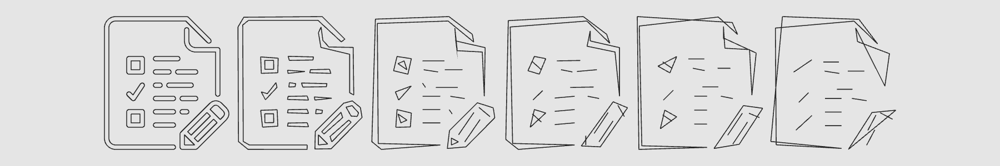

# three-path-geometry

[](http://github.com/badges/stability-badges)



<sup>*Above: a `BufferGeometry` combines several variations of an SVG file.*</sup>

Thick 2D line geometry for ThreeJS, converting a polyline into triangles. This has been optimized and designed for a specific application, so its feature set is limited:

- Supports "Move To" and "Line To" commands for a polyline
- Designed for fixed line thickness
- Supported joins: miter or bevel (with miter limiting)
- Uses a mix of front and back side indexing
- Can incrementally add new paths to the geometry in an optimized manner

This is best suited for a drawing app that needs to render *thousands* of commands, i.e. using a static geometry.

> :bulb: Until [this patch](https://github.com/mrdoob/three.js/pull/9631) lands, dynamic growing/shrinking of buffers is not supported by ThreeJS.

## Install

```sh
npm install three-path-geometry --save
```

## Example

See [./demo/index.js](./demo/index.js) for a full demo, which renders the earlier screenshot of the SVG.

```js
global.THREE = reqiure('three');
const PathGeometry = require('three-path-geometry');

const geometry = new PathGeometry({ thickness: 2 });
geometry.update([
  { type: 'M', position: [ 25, 15 ] },
  { type: 'L', position: [ 50, 15 ] },
  { type: 'L', position: [ 50, 25 ] }
]);

const material = new THREE.MeshBasicMaterial({
  color: 'black',
  side: THREE.DoubleSide // needed for this geometry
});

const mesh = new THREE.Mesh(geometry, material);
mesh.frustumCulled = false; // currently needed for 2D geometries

scene.add(mesh);
```

This module expects `THREE` to exist on global scope.

## Usage

[](https://www.npmjs.com/package/three-path-geometry)

#### `geometry = new PathGeometry([opt])`

Creates a new PathGeometry with the options:

- `thickness` — the thickness of the line in world units, default 1
- `miterLimit` — the limit to use when mitering line joins, default 8 (use `Infinity` for pure bevel, 0 for pure miter)

#### `geometry.clear()`

Clears the current geometry and its paths.

#### `geometry.update(path)`

Clears the geometry and sets it to the new `path`, which is an array of commands like so:

```js
[
  { type: 'M', position: [ 25, 15 ] },
  { type: 'L', position: [ 50, 15 ] }
]
```

Commands can be either type `'M'` (moveTo) or `'L'` (lineTo). The position is a 2D plain array with the `[ x, y ]` value.

#### `geometry.append(path)`

Appends a new path to the existing geometry, without clearing anything first. The commands are the same format as in `update`.

#### `geometry.thickness`

The current thickness of the geometry.

#### `geometry.miterLimit`

The current miter limit of the geometry.

## License

MIT, see [LICENSE.md](http://github.com/Jam3/three-path-geometry/blob/master/LICENSE.md) for details.
